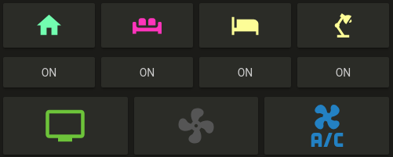
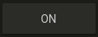

# Button card

Button card is a simple button card to toggle your entities. 

The card toggles on click/tap.



## Features

  - works with any toggleable entity
  - 2 actions on tap `toggle` and `more_info` (more to come)
  - custom color for `on` state
  - custom size
  - custom icon
  - icon automagically takes the color of light entities if rgb attribute is present

## Options

| Name | Type | Default | Description
| ---- | ---- | ------- | -----------
| type | string | **Required** | `custom:button-card`
| entity | string | **Required** | `switch.ac`
| icon | string | optional | Icon to display in place of the state e.g. `mdi:air-conditioner`
| color | string | `var(--primary-text-color)` | Color of the icon when state is `on`. Can be any html color e.g. `rgb(28, 128, 199)`
| size | string | `40%` | Size of the icon. Can be percentage or pixel
| action | string | `toggle` | Define the type of action. Can be `toggle` to toggle the state or `more_info` to show the more info pop-in

## Instructions

1. Download the [button-card](https://raw.githubusercontent.com/kuuji/button-card/master/button-card.js)
2. Place the file in your `config/www` folder
3. Include the card code in your `ui-lovelace-card.yaml`
```yaml
title: Home
resources:
  - url: /local/button-card.js
    type: module
```
4. Write configuration for the card in your `ui-lovelace.yaml`

## Examples


Show a button for the air conditioner (blue when on):
```yaml
- type: "custom:button-card"
  entity: switch.ac
  icon: mdi:air-conditioner
  color: rgb(28, 128, 199)
```


Show an ON/OFF button for the home_lights group:
```yaml
- type: "custom:button-card"
  entity: group.home_lights
```


Light entity with custom icon and "more info" pop-in
```yaml
- type: "custom:button-card"
  entity: light.living_room_lights
  icon: mdi:sofa
  action: more_info
```


## Credits

  - [ciotlosm](https://github.com/ciotlosm) for the readme template and the awesome examples