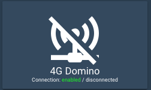

# Button Card <!-- omit in toc -->

[![GitHub Release][releases-shield]][releases]
[![License][license-shield]](LICENSE.md)

![Project Maintenance][maintenance-shield]
[![GitHub Activity][commits-shield]][commits]

[![Discord][discord-shield]][discord]
[![Community Forum][forum-shield]][forum]

Lovelace Button card for your entities.


## TOC <!-- omit in toc -->

- [Features](#features)
- [Configuration](#configuration)
  - [Main Options](#main-options)
  - [Action](#action)
  - [State](#state)
  - [Available operators](#available-operators)
  - [Layout](#layout)
  - [Templates](#templates)
  - [Styles](#styles)
    - [Easy styling options](#easy-styling-options)
    - [ADVANCED styling options](#advanced-styling-options)
- [Installation](#installation)
  - [Manual Installation](#manual-installation)
  - [Installation and tracking with `custom_updater`](#installation-and-tracking-with-custom_updater)
- [Examples](#examples)
  - [Configuration with states](#configuration-with-states)
    - [Default behavior](#default-behavior)
    - [With Operator on state](#with-operator-on-state)
    - [`tap_action` Navigate](#tap_action-navigate)
    - [blink](#blink)
  - [Play with width, height and icon size](#play-with-width-height-and-icon-size)
  - [Templates Support](#templates-support)
    - [Playing with label templates](#playing-with-label-templates)
    - [State Templates](#state-templates)
  - [Styling](#styling)
  - [Lock](#lock)
- [Credits](#credits)


## Features

- works with any toggleable entity
- 6 available actions on **tap** and/or **hold**: `none`, `toggle`, `more-info`, `navigate`, `url` and `call-service`
- state display (optional)
- custom color (optional), or based on light rgb value/temperature
- custom state definition with customizable color, icon and style (optional)
- [custom size of the icon, width and height](#Play-with-width-height-and-icon-size) (optional)
- Support for [templates](#templates) in some fields
- custom icon (optional)
- custom css style (optional)
- multiple [layout](#Layout) support and [custom layout](#advanced-styling-options) support
- units for sensors can be redefined or hidden
- 2 color types
  - `icon` : apply color settings to the icon only
  - `card` : apply color settings to the card only
- automatic font color if color_type is set to `card`
- blank card and label card (for organization)
- [blink](#blink) animation support
- rotating animation support
- confirmation popup for sensitive items (optional) or [locking mecanism](#lock)
- haptic support for the [Beta IOS App](http://home-assistant.io/ios/beta)
- support for [custom_updater](https://github.com/custom-components/custom_updater)

## Configuration

### Main Options

| Name           | Type        | Default      | Supported options                                | Description                                                                                                                                                                                                                                                                                                                                   |
| -------------- | ----------- | ------------ | ------------------------------------------------ | --------------------------------------------------------------------------------------------------------------------------------------------------------------------------------------------------------------------------------------------------------------------------------------------------------------------------------------------- |
| `type`         | string      | **Required** | `custom:button-card`                             | Type of the card                                                                                                                                                                                                                                                                                                                              |
| `entity`       | string      | optional | `switch.ac`                                      | entity_id                                                                                                                                                                                                                                                                                                                                     |
| `icon`         | string      | optional     | `mdi:air-conditioner`                            | Icon to display. Will be overriden by the icon defined in a state (if present). Defaults to the entity icon. Hide with `show_icon: false`                                                                                                                                                                                                     |
| `color_type`   | string      | `icon`       | `icon` \| `card` \| `blank-card` \| `label-card` | Color either the background of the card or the icon inside the card. Setting this to `card` enable automatic `font` and `icon` color. This allows the text/icon to be readable even if the background color is bright/dark. Additional color-type options `blank-card` and `label-card` can be used for organisation (see examples).          |
| `color`        | string      | optional     | `auto` \| `rgb(28, 128, 199)`                    | Color of the icon/card. `auto` sets the color based on the color of a light. By default, if the entity state is `off`, the color will be `var(--paper-item-icon-active-color)`, for `on` it will be `var(--paper-item-icon-color)` and for any other state it will be `var(--primary-text-color)`. You can redefine each colors using `state` |
| `size`         | string      | `40%`        | `20px`                                           | Size of the icon. Can be percentage or pixel                                                                                                                                                                                                                                                                                                  |
| `tap_action` | object | optional | See [Action](#Action) | Define the type of action on click, if undefined, toggle will be used. |
| `hold_action` | object | optional | See [Action](#Action) | Define the type of action on hold, if undefined, nothing happens. |
| `name`         | string      | optional     | `Air conditioner`                                | Define an optional text to show below the icon                                                                                                                                                                                                                                                                                                |
| `label` | string | optional | Any string that you want | Display a label below the card. See [Layouts](#layout) for more information. |
| `label_template` | string | optional | | See [templates](#templates). Any javascript code which returns a string. Overrides `label` |
| `show_name`    | boolean     | `true`       | `true` \| `false`                                | Wether to show the name or not. Will pick entity_id's name by default, unless redefined in the `name` property or in any state `name` property                                                                                                                                                                                                |
| `show_state`   | boolean     | `false`      | `true` \| `false`                                | Show the state on the card. defaults to false if not set                                                                                                                                                                                                                                                                                      |
| `show_icon`    | boolean     | `true`       | `true` \| `false`                                | Wether to show the icon or not. Unless redefined in `icon`, uses the default entity icon from hass                                                                                                                                                                                                                                            |
| `show_units` | boolean | `true` | `true` \| `false` | Display or hide the units of a sensor, if any. |
| `show_label` | boolean | `false` | `true` \| `false` | Display or hide the `label`/`label_template` |
| `show_last_changed` | boolean | `false` | `true` \| `false` | Replace the label altogether and display the the `last_changed` attribute in a nice way (eg: `12 minutes ago`) |
| `show_entity_picture` | boolean | `false` | `true` \| `false` | Replace the icon by the entity picture (if any) or the custom picture (if any). Falls back to using the icon if both are undefined |
| `entity_picture` | string | optional | Can be any of `/local/*` file or a URL | Will override the icon/the default entity_picture with your own image. Best is to use a square image. You can also define one per state |
| `units` | string | optional | `Kb/s`, `lux`, ... | Override or define the units to display after the state of the entity. If omitted, it's using the entity's units |
| `styles`        | object list | optional     | | See [styles](#styles)  |
| `state`        | object list | optional     | See [State](#State)                              | State to use for the color, icon and style of the button. Multiple states can be defined                                                                                                                                                                                                                                                      |
| `confirmation` | string     | optional      | Free-form text                               | Show a confirmation popup on tap with defined text                                                                                                                                                                                                                                                                                                            |
| `lock` | boolean | `false` | `true` \| `false` | See [lock](#lock). This will display a normal button with a lock symbol in the corner. Clicking the button will make the lock go away and enable the button to be manoeuvred for five seconds |
| `layout` | string | optional | See [Layout](#Layout) | The layout of the button can be modified using this option |

### Action

| Name              | Type   | Default  | Supported options                                                | Description                                                                                              |
| ----------------- | ------ | -------- | ---------------------------------------------------------------- | -------------------------------------------------------------------------------------------------------- |
| `action`          | string | `toggle` | `more-info`, `toggle`, `call-service`, `none`, `navigate`, `url` | Action to perform                                                                                        |
| `navigation_path` | string | none     | Eg: `/lovelace/0/`                                               | Path to navigate to (e.g. `/lovelace/0/`) when action defined as navigate                                |
| `url`             | string | none     | Eg: `https://www.google.fr`                                      | URL to open on click when action is `url`. The URL will open in a new tab                                |
| `service`         | string | none     | Any service                                                      | Service to call (e.g. `media_player.media_play_pause`) when `action` defined as `call-service`           |
| `service_data`    | object | none     | Any service data                                                 | Service data to include (e.g. `entity_id: media_player.bedroom`) when `action` defined as `call-service` |
| `haptic` | string | none | `success`, `warning`, `failure`, `light`, `medium`, `heavy`, `selection` | Haptic feedback for the [Beta IOS App](http://home-assistant.io/ios/beta) |

### State

| Name       | Type          | Default                                     | Supported options                                                                                                                                                          | Description                                                                                   |
| ---------- | ------------- | ------------------------------------------- | -------------------------------------------------------------------------------------------------------------------------------------------------------------------------- | --------------------------------------------------------------------------------------------- |
| `operator` | string        | `==`                                        | See [Available Operators](#Available-operators)                                                                                                                            | The operator used to compare the current state against the `value`                            |
| `value`    | string/number | **required** (unless operator is `default`) | If your entity is a sensor with numbers, use a number directly, else use a string                                                                                          | The value which will be compared against the current state of the entity                      |
| `name`     | string        | optional                                    | Any string, `'Alert'`, `'My little switch is on'`, ...                                                                                                                     | if `show_name` is `true`, the name to display for this state. If undefined, uses the general config `name`, and if undefined uses the entity name |
| `icon`     | string        | optional                                    | `mdi:battery`                                                                                                                                                              | The icon to display for this state. Defaults to the entity icon. Hide with `show_icon: false` |
| `color`    | string        | `var(--primary-text-color)`                 | Any color, eg: `rgb(28, 128, 199)` or `blue`                                                                                                                               | The color of the icon (if `color_type: icon`) or the background (if `color_type: card`)       |
| `styles`    | string        | optional | | See [styles](#styles) |
| `spin`     | boolean       | `false`                                     | `true` \| `false`                                                                                                                                                          | Should the icon spin for this state?                                                          |
| `entity_picture` | string | optional | Can be any of `/local/*` file or a URL | Will override the icon/the default entity_picture with your own image for this state. Best is to use a square image |
| `label` | string | optional | Any string that you want | Display a label below the card. See [Layouts](#layout) for more information. |
| `label_template` | string | optional | | See [templates](#templates). Any javascript code which returns a string. Overrides `label` |

### Available operators

The order of your elements in the `state` object matters. The first one which is `true` will match.

| Operator  | `value` example | Description                                                                                              |
| :-------: | --------------- | -------------------------------------------------------------------------------------------------------- |
|    `<`    | `5`             | Current state is inferior to `value`                                                                     |
|   `<=`    | `4`             | Current state is inferior or equal to `value`                                                            |
|   `==`    | `42` or `'on'`  | **This is the default if no operator is specified.** Current state is equal (`==` javascript) to `value` |
|   `>=`    | `32`            | Current state is superior or equal to `value`                                                            |
|    `>`    | `12`            | Current state is superior to `value`                                                                     |
|   `!=`    | `'normal'`      | Current state is not equal (`!=` javascript) to `value`                                                  |
|  `regex`  | `'^norm.*$'`    | `value` regex applied to current state does match                                                        |
| `template` | | See [templates](#templates) for examples. `value` needs to be a javascript expression which returns a boolean. If the boolean is true, it will match this state |
| `default` | N/A             | If nothing matches, this is used                                                                         |

### Layout

This option enables you to modify the layout of the card.

It is fully compatible with every `show_*` option. Make sure you set `show_state: true` if you want to show the state

Multiple values are possible, see the image below for examples:
* `vertical` (default value if nothing is provided): Everything is centered vertically on top of each other
* `icon_name_state`: Everything is aligned horizontally, name and state are concatenated, label is centered below
* `name_state`: Icon sits on top of name and state concatenated on one line, label below
* `icon_name`: Icon and name are horizontally aligned, state and label are centered below
* `icon_state`: Icon and state are horizontally aligned, name and label are centered below
* `icon_label`: Icon and label are horizontally aligned, name and state are centered below
* `icon_name_state2nd`: Icon, name and state are horizontally aligned, name is above state, label below name and state
* `icon_state_name2nd`: Icon, name and state are horizontally aligned, state is above name, label below name and state


### Templates

`label_template` supports templating as well as `value` for `state` when `operator: template`
* `label_template`: It will be interpreted as javascript code and the code should return a string.
  `label_template` supports inline HTML, so you can do stuff like:
  ```yaml
  label_template: >
    return 'Connection: '
    + (states['switch.connection'].state === 'on'
        ? '<span style="color: #00FF00;">enabled</span>'
        : '<span style="color: #FF0000;">disabled</span>')
    + ' / '
    + (states['binary_sensor.status'].state === 'on' ? 'connected' : 'disconnected')
  ```
  
* `value` for `state` when `operator: template`: It will be interpreted as javascript code and the code should return a boolean (`true` or `false`)

Inside the javascript code, you'll have access to those variables:
* `entity`: The current entity object, if the entity is defined in the card
* `states`: An object with all the states of all the entities (equivalent to `hass.states`)
* `user`: The user object (equivalent to `hass.user`)
* `hass`: The complete `hass` object

The value shouldn't be enclosed in quotes:
```yaml
label_template: >
  return states['light.mylight'].attributes.brightness
```
or
```yaml
state:
  - operator: template
    value: >
      return states['input_select.light_mode'].state === 'night_mode'
```

See [here](#templates-support) for some examples.

### Styles

#### Easy styling options

For each element in the card, styles can be defined in 2 places:
* in the main part of the config
* in each state

Styles defined in each state are **additive** with the ones defined in the main part of the config. In the `state` part, just define the ones specific to your current state and keep the common ones in the main part of the config.

The `style` object members are:
* `card`: styles for the card itself. Styles that are defined here will be applied to the whole card and it's content, unless redefined in elements below.
* `icon`: styles for the icon
* `entity_picture`: styles for the picture (if any)
* `name`: styles for the name
* `state`: styles for the state
* `label`: styles for the label
* `lock`: styles for the lock icon (see [here](https://github.com/custom-cards/button-card/blob/master/src/styles.ts#L36-L49) for the default style)

```yaml
- type: custom:button-card
  [...]
  styles:
    card:
      - xxxx: value
    icon:
      - xxxx: value
    entity_picture:
      - xxxx: value
    name:
      - xxxx: value
    state:
      - xxxx: value
    label:
      - xxxx: value
  state:
    - value: 'on'
      styles:
        card:
          - yyyy: value
        icon:
          - yyyy: value
        entity_picture:
          - yyyy: value
        name:
          - yyyy: value
        state:
          - yyyy: value
        label:
          - yyyy: value
```
This will render:
* The `card` with the styles `xxxx: value` **and** `yyyy: value` applied
* Same for all the others.

See [styling](#styling) for a complete example.

#### ADVANCED styling options

For advanced styling, there are 2 other options in the `styles` config object:
* `grid`: mainly layout for the grid
* `img_cell`: mainly how you position your icon in it's cell

This is how the button is constructed (HTML elements):


The `grid` element uses CSS grids to design the layout of the card:
* `img_cell` element is going to the `grid-area: i` by default
* `name` element is going to the `grid-area: n` by default
* `state` element is going to the `grid-area: s` by default
* `label` element is going to the `grid-area: l` by default

You can see how the default layouts are constructed [here](./src/styles.ts#L152) and inspire yourself with it. We'll not support advanced layout questions here, please use [home-assitant's community forum][forum] for that.

To learn more, please use Google and this [excellent guide about CSS Grids](https://css-tricks.com/snippets/css/complete-guide-grid/) :)

Some examples:
* label on top:
  ```yaml
  styles:
    grid:
      - grid-template-areas: '"l" "i" "n" "s"'
      - grid-template-rows: min-content 1fr min-content min-content
      - grid-template-columns: 1fr
  ```
* icon on the right side (by overloading an existing layout):
  ```yaml
  - type: "custom:button-card"
    entity: sensor.sensor1
    layout: icon_state_name2nd
    show_state: true
    show_name: true
    show_label: true
    label: label
    styles:
      grid:
        - grid-template-areas: '"n i" "s i" "l i"'
        - grid-template-columns: 1fr 40%
  ```

* Apple Homekit-like buttons:
  
  ```yaml
  - type: custom:button-card
    entity: switch.skylight
    name: <3 Apple
    icon: mdi:fire
    show_state: true
    styles:
      card:
        - width: 100px
        - height: 100px
      grid:
        - grid-template-areas: '"i" "n" "s"'
        - grid-template-columns: 1fr
        - grid-template-rows: 1fr min-content min-content
      img_cell:
        - align-self: start
        - text-align: start
      name:
        - justify-self: start
        - padding-left: 10px
        - font-weight: bold
        - text-transform: lowercase
      state:
        - justify-self: start
        - padding-left: 10px
    state:
      - value: 'off'
        styles:
          card:
            - filter: opacity(50%)
          icon:
            - filter: grayscale(100%)
  ```

## Installation

### Manual Installation

1. Download the [button-card](https://raw.githubusercontent.com/custom-cards/button-card/master/dist/button-card.js)
2. Place the file in your `config/www` folder
3. Include the card code in your `ui-lovelace-card.yaml`

```yaml
title: Home
resources:
  - url: /local/button-card.js
    type: module
```

4. Write configuration for the card in your `ui-lovelace.yaml`

### Installation and tracking with `custom_updater`

1. Make sure the [custom_updater](https://github.com/custom-components/custom_updater) component is installed and working.
2. Configure Lovelace to load the card.

```yaml
resources:
  - url: /customcards/github/custom-cards/button-card.js?track=true
    type: module
```

3. Run the service `custom_updater.check_all` or click the "CHECK" button if you use the [`tracker-card`](https://github.com/custom-cards/tracker-card).
4. Refresh the website.

## Examples

Show a button for the air conditioner (blue when on, `var(--disabled-text-color)` when off):


```yaml
- type: "custom:button-card"
  entity: switch.ac
  icon: mdi:air-conditioner
  color: rgb(28, 128, 199)
```

Redefine the color when the state if off to red:

```yaml
- type: "custom:button-card"
  entity: switch.ac
  icon: mdi:air-conditioner
  color: rgb(28, 128, 199)
  state:
    - value: "off"
      color: rgb(255, 0, 0)
```

---

Show an ON/OFF button for the home_lights group:


```yaml
- type: "custom:button-card"
  entity: group.home_lights
  show_icon: false
  show_state: true
```

---

Light entity with custom icon and "more info" pop-in:


```yaml
- type: "custom:button-card"
  entity: light.living_room_lights
  icon: mdi:sofa
  color: auto
  tap_action:
    action: more-info
```

---

Light card with card color type, name, and automatic color:


```yaml
- type: "custom:button-card"
  entity: light._
  icon: mdi:home
  color: auto
  color_type: card
  tap_action:
    action: more-info
  name: Home
  styles:
    card:
      - font-size: 12px
      - font-weight: bold
```

---

Horizontal stack with :

- 2x blank cards
- 1x volume up button with service call
- 1x volume down button with service call
- 2x blank cards


```yaml
- type: horizontal-stack
  cards:
    - type: "custom:button-card"
      color_type: blank-card
    - type: "custom:button-card"
      color_type: blank-card
    - type: "custom:button-card"
      color_type: card
      color: rgb(223, 255, 97)
      icon: mdi:volume-plus
      tap_action:
        action: call-service
        service: media_player.volume_up
        service_data:
          entity_id: media_player.livimg_room_speaker
    - type: "custom:button-card"
      color_type: card
      color: rgb(223, 255, 97)
      icon: mdi:volume-minus
      tap_action:
        action: call-service
        service: media_player.volume_down
        service_data:
          entity_id: media_player.livimg_room_speaker
    - type: "custom:button-card"
      color_type: blank-card
    - type: "custom:button-card"
      color_type: blank-card
```

---

Vertical Stack with :

- 1x label card
- Horizontal Stack with :
  - 1x Scene 1 Button
  - 1x Scene 2 Button
  - 1x Scene 3 Button
  - 1x Scene 4 Button
  - 1x Scene Off Button


```yaml
- type: vertical-stack
  cards:
    - type: "custom:button-card"
      color_type: label-card
      color: rgb(44, 109, 214)
      name: Kitchen
    - type: horizontal-stack
      cards:
        - type: "custom:button-card"
          entity: switch.kitchen_scene_1
          color_type: card
          color: rgb(66, 134, 244)
          icon: mdi:numeric-1-box-outline
        - type: "custom:button-card"
          entity: switch.kitchen_scene_2
          color_type: card
          color: rgb(66, 134, 244)
          icon: mdi:numeric-2-box-outline
        - type: "custom:button-card"
          entity: switch.kitchen_scene_3
          color_type: card
          color: rgb(66, 134, 244)
          icon: mdi:numeric-3-box-outline
        - type: "custom:button-card"
          entity: switch.kitchen_scene_4
          color_type: card
          color: rgb(66, 134, 244)
          icon: mdi:numeric-4-box-outline
        - type: "custom:button-card"
          entity: switch.kitchen_off
          color_type: card
          color: rgb(66, 134, 244)
          icon: mdi:eye-off-outline
```

### Configuration with states

Input select card with select next service and custom color and icon for states. In the example below the icon `mdi:cube-outline` will be used when value is `sleeping` and `mdi:cube` in other cases.


#### Default behavior

If you don't specify any operator, `==` will be used to match the current state against the `value`

```yaml
- type: "custom:button-card"
  entity: input_select.cube_mode
  icon: mdi:cube
  tap_action:
    action: call-service
    service: input_select.select_next
    service_data:
      entity_id: input_select.cube_mode
  show_state: true
  state:
    - value: "sleeping"
      color: var(--disabled-text-color)
      icon: mdi:cube-outline
    - value: "media"
      color: rgb(5, 147, 255)
    - value: "light"
      color: rgb(189, 255, 5)
```

#### With Operator on state

The definition order matters, the first item to match will be the one selected.

```yaml
- type: "custom:button-card"
  entity: sensor.temperature
  show_state: true
  state:
    - value: 15
      operator: '<='
      color: blue
      icon: mdi:thermometer-minus
    - value: 25
      operator: '>='
      color: red
      icon: mdi:thermometer-plus
    - operator: 'default' # used if nothing matches
      color: yellow
      icon: mdi: thermometer
      styles:
        card:
          - opacity: 0.5
```

#### `tap_action` Navigate

Buttons can link to different views using the `navigate` action:

```yaml
- type: "custom:button-card"
  color_type: label-card
  icon: mdi:home
  name: Go To Home
  tap_action:
    action: navigate
    navigation_path: /lovelace/0
```

The `navigation_path` also accepts any Home Assistant internal URL such as /dev-info or /hassio/dashboard for example.

#### blink

You can make the whole button blink:


```yaml
- type: "custom:button-card"
  color_type: card
  entity: binary_sensor.intruder
  name: Intruder Alert
  state:
    - value: "on"
      color: red
      icon: mdi:alert
      styles:
        card:
          - animation: blink 2s ease infinite
    - operator: default
      color: green
      icon: mdi:shield-check
```

### Play with width, height and icon size

Through the `styles` you can specify the `width` and `height` of the card, and also the icon size through the main `size` option. Playing with icon size will growth the card unless a `height` is specified.

If you specify a width for the card, it has to be in `px`. All the cards without a `width` defined will use the remaining space on the line.


```yaml
- type: horizontal-stack
  cards:
    - type: "custom:button-card"
      entity: light.test_light
      color: auto
      name: s:default h:200px
      styles:
        card:
          - height: 200px
    - type: "custom:button-card"
      entity: light.test_light
      color_type: card
      color: auto
      name: s:100% h:200px
      size: 100%
      styles:
        card:
          - height: 200px
    - type: "custom:button-card"
      entity: light.test_light
      color_type: card
      color: auto
      size: 10%
      name: s:10% h:200px
      styles:
        card:
          - height: 200px
- type: horizontal-stack
  cards:
    - type: "custom:button-card"
      entity: light.test_light
      color: auto
      name: 60px
      styles:
        card:
          - height: 60px
          - width: 60px
    - type: "custom:button-card"
      entity: light.test_light
      color_type: card
      color: auto
      name: 80px
      styles:
        card:
          - height: 80px
          - width: 30px
    - type: "custom:button-card"
      entity: light.test_light
      color_type: card
      color: auto
      name: 300px
      styles:
        card:
          - height: 300px
```
### Templates Support

#### Playing with label templates


```yaml
- type: "custom:button-card"
  color_type: icon
  entity: light.test_light
  label_template: >
    var bri = states['light.test_light'].attributes.brightness;
    return 'Brightness: ' + (bri ? bri : '0') + '%';
  show_label: true
  size: 15%
  styles:
    card:
      - height: 100px
- type: "custom:button-card"
  color_type: icon
  entity: light.test_light
  layout: icon_label
  label_template: >
    return 'Other State: ' + states['switch.skylight'].state;
  show_label: true
  show_name: false
  styles:
    card:
      - height: 100px
```

#### State Templates

The javascript code inside `value` needs to return `true` of `false`.

Example with `template`:
```yaml
- type: "custom:button-card"
  color_type: icon
  entity: switch.skylight
  show_state: true
  show_label: true
  state:
    - operator: template
      value: >
        return states['light.test_light'].attributes
        && (states['light.test_light'].attributes.brightness <= 100)
      icon: mdi:alert
    - operator: default
      icon: mdi:lightbulb
- type: "custom:button-card"
  color_type: icon
  entity: light.test_light
  show_label: true
  state:
    - operator: template
      value: >
        return states['input_select.light_mode'].state === 'night_mode'
      icon: mdi:weather-night
      label: Night Mode
    - operator: default
      icon: mdi:white-balance-sunny
      label: Day Mode
```

### Styling


```yaml
- type: "custom:button-card"
  color_type: icon
  entity: light.test_light
  label_template: >
    var bri = states['light.test_light'].attributes.brightness;
    return 'Brightness: ' + (bri ? bri : '0') + '%';
  show_label: true
  show_state: true
  size: 10%
  styles:
    card:
      - height: 100px
    label:
      - color: gray
      - font-size: 9px
      - justify-self: start
      - padding: 0px 5px
    name:
      - text-transform: uppercase
      - letter-spacing: 0.5em
      - font-familly: cursive
      - justify-self: start
      - padding: 0px 5px
    state:
      - justify-self: start
      - font-size: 10px
      - padding: 0px 5px
  state:
    - value: 'on'
      styles:
        state:
          - color: green
    - value: 'off'
      styles:
        state:
          - color: red
        card:
          - filter: brightness(40%)
- type: "custom:button-card"
  color_type: icon
  entity: light.test_light
  layout: icon_label
  label_template: >
    return 'Other State: ' + states['switch.skylight'].state;
  show_label: true
  show_name: false
  size: 100%
  styles:
    card:
      - height: 200px
    label:
      - font-weight: bold
      - writing-mode: vertical-rl
      - text-orientation: mixed
  state:
    - value: 'on'
      styles:
        label:
          - color: red
    - value: 'off'
      styles:
        label:
          - color: green
```

### Lock


```yaml
- type: horizontal-stack
  cards:
    - type: "custom:button-card"
      entity: switch.test
      lock: true
    - type: "custom:button-card"
      color_type: card
      lock: true
      color: black
      entity: switch.test
```

## Credits

- [ciotlosm](https://github.com/ciotlosm) for the readme template and the awesome examples

[commits-shield]: https://img.shields.io/github/commit-activity/y/custom-cards/button-card.svg?style=for-the-badge
[commits]: https://github.com/custom-cards/button-card/commits/master
[discord]: https://discord.gg/Qa5fW2R
[discord-shield]: https://img.shields.io/discord/330944238910963714.svg?style=for-the-badge
[forum-shield]: https://img.shields.io/badge/community-forum-brightgreen.svg?style=for-the-badge
[forum]: https://community.home-assistant.io/t/lovelace-button-card/65981
[license-shield]: https://img.shields.io/github/license/custom-cards/button-card.svg?style=for-the-badge
[maintenance-shield]: https://img.shields.io/maintenance/yes/2019.svg?style=for-the-badge
[releases-shield]: https://img.shields.io/github/release/custom-cards/button-card.svg?style=for-the-badge
[releases]: https://github.com/custom-cards/button-card/releases
