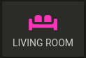
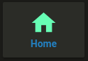
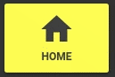
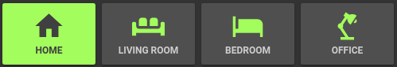

# Button card

Lovelace Button card for your entities. 


## Features

  - works with any toggleable entity
  - 2 actions on tap `toggle` and `more_info` (more to come)
  - state display (optional)
  - custom color for `on` and `off` state (optional)
  - custom size (optional)
  - custom icon (optional)
  - custom css style (optional)
  - automatic color for light (optional)
  - custom default color for lights (when color cannot be determined) (optional)
  - 2 color types
    - `icon` : apply color settings to the icon only
    - `card` : apply color settings to the card only
  - automatic font color if color_type is set to `card`

## Options

| Name | Type | Default | Supported options  | Description
| ---- | ---- | ------- | --------- | -----------
| type | string | **Required** | `custom:button-card` | Type of the card
| entity | string | **Required** | `switch.ac` | entity_id
| icon | string | optional | `mdi:air-conditioner` | Icon to display in place of the state
| color_type | string | `icon` | `icon` \| `card` | Color either the background of the card or the icon inside the card. Setting this to `card` enable automatic `font` and `icon` color. This allows the text/icon to be readable even if the background color is bright/dark.
| color | string | `var(--primary-text-color)` | `auto` \| `rgb(28, 128, 199)` |  Color of the icon/card when state is `on`. `auto` sets the color based on the color of a light.
| color_off | string | `var(--disabled-text-color)` | `rgb(28, 128, 199)` |  Color of the icon/card when state is `off`.
| size | string | `40%` | `20px` | Size of the icon. Can be percentage or pixel
| action | string | `toggle` | `toggle` \| `more_info` | Define the type of action
| name | string | optional | `Air conditioner` | Define an optional text to show below the icon
| show_state | boolean | `false` | `true` \| `false` | Show the state on the card. defaults to false if not set
| style | object | optional | `- text-transform: none` | Define a list of css attribute and their value to apply to the card

## Instructions

1. Download the [button-card](https://raw.githubusercontent.com/kuuji/button-card/master/button-card.js)
2. Place the file in your `config/www` folder
3. Include the card code in your `ui-lovelace-card.yaml`
```yaml
title: Home
resources:
  - url: /local/button-card.js
    type: module
```
4. Write configuration for the card in your `ui-lovelace.yaml`

## Examples


Show a button for the air conditioner (blue when on):


```yaml
- type: "custom:button-card"
  entity: switch.ac
  icon: mdi:air-conditioner
  color: rgb(28, 128, 199)
```
---------

Show an ON/OFF button for the home_lights group:


```yaml
- type: "custom:button-card"
  entity: group.home_lights
  show_state: true
```


----------------

Light entity with custom icon and "more info" pop-in:6


```yaml
- type: "custom:button-card"
  entity: light.living_room_lights
  icon: mdi:sofa
  color: auto
  action: more_info
```


-------------------------

Light card with text:



```yaml
- type: "custom:button-card"
  entity: light.living_room_lights
  icon: mdi:sofa
  color: auto
  name: Living room
```


-------------

Light card with text and custom style:



```yaml
- type: "custom:button-card"
  entity: light._
  icon: mdi:home
  color: auto
  action: more_info
  name: Home
  style:
    - text-transform: none
    - color: rgb(28, 128, 199)
    - font-weight: bold
```


-----

Light card with card color type, name, and automatic color:



```yaml
- type: "custom:button-card"
  entity: light._
  icon: mdi:home
  color: auto
  color_type: card
  default_color: rgb(255, 233, 155)
  action: more_info
  name: Home
  style:
    - font-size: 12px
    - font-weight: bold
```

---------------

Home + all rooms in an horizontal stack




```yaml
- type: horizontal-stack
  cards:
    - type: "custom:button-card"
      entity: light.living_room_lights
      icon: mdi:sofa
      color: auto
      action: more_info
      default_color: rgb(255, 233, 155)
      color_type: card
      name: Living room
      style:
        - font-size: 12px
        - font-weight: bold
    - type: "custom:button-card"
      entity: light.harry
      color: auto
      icon: mdi:ceiling-light
      action: more_info
      name: Ceiling
      style:
        - font-size: 12px
        - font-weight: bold
    - type: "custom:button-card"
      entity: light.ron
      color: auto
      icon: mdi:lamp
      action: more_info
      name: TV
      style:
        - font-size: 12px
        - font-weight: bold
    - type: "custom:button-card"
      entity: light.snape
      icon: mdi:floor-lamp
      color: auto
      action: more_info
      name: Floor
      style:
        - font-size: 12px
        - font-weight: bold
```


## Credits

  - [ciotlosm](https://github.com/ciotlosm) for the readme template and the awesome examples