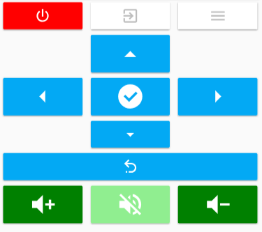

# Button card

Simple button card for your entities. 


## Features

  - works with any toggleable entity
  - 2 actions on tap `toggle` and `more_info` (more to come)
  - shows state if no icon specified for a very simple on/off button
  - custom color for `on` state
  - custom size
  - custom icon
  - icon automagically takes the color of light entities if rgb attribute is present

## Options

| Name | Type | Default | Example   | Description
| ---- | ---- | ------- | --------- | -----------
| type | string | **Required** | `custom:button-card` | Type of the card
| entity | string | **Required** | `switch.ac` | entity_id
| icon | string | optional | `mdi:air-conditioner` | Icon to display in place of the state
| color | string | `var(--primary-text-color)` | `rgb(28, 128, 199)` |  Color of the icon when state is `on`. Can be any html color
| size | string | `40%` | `20px` | Size of the icon. Can be percentage or pixel
| action | string | `toggle` | `toggle` \| `more_info` | Define the type of action
| name | string | optional | `Air conditioner` | Define an optional text to show below the icon
| style | object | optional | `- text-transform: none` | Define a list of css attribute and their value to apply to the card

## Instructions

1. Download the [button-card](https://raw.githubusercontent.com/kuuji/button-card/master/button-card.js)
2. Place the file in your `config/www` folder
3. Include the card code in your `ui-lovelace-card.yaml`
```yaml
title: Home
resources:
  - url: /local/button-card.js
    type: module
  - url: /local/custom_ui/no-card.js
    type: module
```
4. Write configuration for the card in your `ui-lovelace.yaml`

## Examples


Show a button for the air conditioner (blue when on):
```yaml
- type: "custom:button-card"
  entity: switch.ac
  icon: mdi:air-conditioner
  color: rgb(28, 128, 199)
```


Show an ON/OFF button for the home_lights group:
```yaml
- type: "custom:button-card"
  entity: group.home_lights
```


Light entity with custom icon and "more info" pop-in
```yaml
- type: "custom:button-card"
  entity: light.living_room_lights
  icon: mdi:sofa
  action: more_info
```


Light card with text

```yaml
- type: "custom:button-card"
  entity: light.living_room_lights
  icon: mdi:sofa
  name: Living room
```


Light card with text and custom style

```yaml
- type: "custom:button-card"
  entity: light._
  icon: mdi:home
  action: more_info
  name: Home
  style:
    - text-transform: none
    - color: rgb(28, 128, 199)
    - font-weight: bold
```


Empty space

```yaml
- type: "custom:no-card"
```

Remote Controller

```yaml
- type: vertical-stack
  cards:
   - type: horizontal-stack
     cards:
      - type: "custom:button-card"
        entity: script.projector_on_off
        icon: mdi:power
        size: 40px
        style:
         - text-transform: none
         - color: white
         - background-color: red
      - type: "custom:button-card"
        entity: script.projector_source
        icon: mdi:login-variant
        color: lightgrey
        size: 40px
      - type: "custom:button-card"
        entity: script.projector_menu
        icon: mdi:menu
        size: 40px
        
   - type: horizontal-stack
     cards:
      - type: "custom:no-card"
      - type: "custom:button-card"
        entity: script.projector_up
        icon: mdi:menu-up
        style:
         - text-transform: none
         - color: white
         - background-color: var(--primary-color)
      - type: "custom:no-card"
      
   - type: horizontal-stack
     cards:
      - type: "custom:button-card"
        entity: script.projector_left
        icon: mdi:menu-left
        style:
         - text-transform: none
         - color: white
         - background-color: var(--primary-color)
      - type: "custom:button-card"
        entity: script.projector_ok
        icon: mdi:check-circle
        style:
         - text-transform: none
         - color: white
         - background-color: var(--primary-color)
      - type: "custom:button-card"
        entity: script.projector_right
        icon: mdi:menu-right
        style:
         - text-transform: none
         - color: white
         - background-color: var(--primary-color)

   - type: horizontal-stack
     cards:
      - type: "custom:no-card"
      - type: "custom:button-card"
        entity: script.projector_down
        icon: mdi:menu-down
        size: 40px
        style:
         - text-transform: none
         - color: white
         - background-color: var(--primary-color)
      - type: "custom:no-card"

   - type: horizontal-stack
     cards:
      - type: "custom:button-card"
        entity: script.projector_back
        icon: mdi:undo-variant
        size: 40px
        style:
         - text-transform: none
         - color: white
         - background-color: var(--primary-color)

   - type: horizontal-stack
     cards:
      - type: "custom:button-card"
        entity: script.projector_volume_up
        icon: mdi:volume-plus
        style:
         - text-transform: none
         - color: white
         - background-color: green
      - type: "custom:button-card"
        entity: script.projector_volume_mute
        icon: mdi:volume-off
        style:
         - text-transform: none
         - color: white
         - background-color: lightgreen
      - type: "custom:button-card"
        entity: script.projector_volume_down
        icon: mdi:volume-minus
        style:
         - text-transform: none
         - color: white
         - background-color: green
```



## Credits

  - [ciotlosm](https://github.com/ciotlosm) for the readme template and the awesome examples
