# Button Card by [@RomRider](https://github.com/RomRider) <!-- omit in toc -->

[![Stable][releases-shield]][releases] [![Beta][releases-dev-shield]][releases-dev] [![HACS Badge][hacs-badge]][hacs-link] ![Project Maintenance][maintenance-shield] <br/> ![Downloads][downloads] [![GitHub Activity][commits-shield]][commits] [![License][license-shield]](LICENSE.md) [![Discord][discord-shield]][discord] [![Community Forum][forum-shield]][forum]

[commits-shield]: https://img.shields.io/github/commit-activity/y/custom-cards/button-card.svg
[commits]: https://github.com/custom-cards/button-card/commits/master
[discord]: https://discord.gg/Qa5fW2R
[discord-shield]: https://img.shields.io/discord/330944238910963714.svg
[forum-shield]: https://img.shields.io/badge/community-forum-brightgreen.svg
[forum]: https://community.home-assistant.io/t/lovelace-button-card/65981
[license-shield]: https://img.shields.io/github/license/custom-cards/button-card.svg
[maintenance-shield]: https://img.shields.io/maintenance/yes/2023.svg
[releases-shield]: https://img.shields.io/github/release/custom-cards/button-card.svg
[releases]: https://github.com/custom-cards/button-card/releases/latest
[releases-dev-shield]: https://img.shields.io/github/package-json/v/custom-cards/button-card/dev?label=release%40dev
[releases-dev]: https://github.com/custom-cards/button-card/releases
[hacs-badge]: https://img.shields.io/badge/HACS-Default-41BDF5.svg
[downloads]: https://img.shields.io/github/downloads/custom-cards/button-card/total
[hacs-link]: https://hacs.xyz/

Lovelace Button card for your entities.


## TOC <!-- omit in toc -->

- [Features](#features)
- [Configuration](#configuration)
  - [Main Options](#main-options)
  - [Action](#action)
  - [Confirmation](#confirmation)
  - [Lock Object](#lock-object)
  - [State](#state)
  - [Available operators](#available-operators)
  - [Layout](#layout)
  - [`triggers_update`](#triggers_update)
  - [Javascript Templates](#javascript-templates)
  - [Styles](#styles)
    - [Easy styling options](#easy-styling-options)
    - [Light entity color variable](#light-entity-color-variable)
    - [ADVANCED styling options](#advanced-styling-options)
    - [Injecting CSS with `extra_styles`](#injecting-css-with-extra_styles)
  - [Custom Fields](#custom-fields)
  - [Configuration Templates](#configuration-templates)
    - [General](#general)
    - [Merging state by id](#merging-state-by-id)
    - [Variables](#variables)
- [Installation](#installation)
  - [Manual Installation](#manual-installation)
  - [Installation and tracking with `hacs`](#installation-and-tracking-with-hacs)
- [Examples](#examples)
  - [Configuration with states](#configuration-with-states)
    - [Default behavior](#default-behavior)
    - [With Operator on state](#with-operator-on-state)
    - [`tap_action` Navigate](#tap_action-navigate)
    - [blink](#blink)
  - [Play with width, height and icon size](#play-with-width-height-and-icon-size)
  - [Templates Support](#templates-support)
    - [Playing with label templates](#playing-with-label-templates)
    - [State Templates](#state-templates)
  - [Styling](#styling)
  - [Lock](#lock)
  - [Aspect Ratio](#aspect-ratio)
  - [Changing the feedback color during a click](#changing-the-feedback-color-during-a-click)
- [Community guides](#community-guides)
- [Credits](#credits)

## Features

- works with any toggleable entity
- 6 available actions on **tap** and/or **hold** and/or **double click**: `none`, `toggle`, `more-info`, `navigate`, `url`, `assist` and `call-service`
- state display (optional)
- custom color (optional), or based on light rgb value/temperature
- custom state definition with customizable color, icon and style (optional)
- [custom size of the icon, width and height](#Play-with-width-height-and-icon-size) (optional)
- [aspect ratio support](#aspect-ratio) (optional)
- Support for [javascript templates](#javascript-templates) in some fields
- custom icon (optional)
- custom css style (optional)
- multiple [layout](#Layout) support and [custom layout](#advanced-styling-options) support
- units for sensors can be redefined or hidden
- 2 color types
  - `icon` : apply color settings to the icon only
  - `card` : apply color settings to the card only
- automatic font color if color_type is set to `card`
- blank card and label card (for organization)
- [blink](#blink) animation support
- rotating animation support
- confirmation popup for sensitive items (optional) or [locking mecanism](#lock)
- haptic support for the [IOS companion App](https://companion.home-assistant.io/docs/integrations/haptics)
- support for [custom_updater](https://github.com/custom-components/custom_updater) and [HACS](https://github.com/hacs/integration)

## Configuration

### Main Options

| Name | Type | Default | Supported options | Description |
| --- | --- | --- | --- | --- |
| `type` | string | **Required** | `custom:button-card` | Type of the card |
| `template` | string | optional | any valid template from `button_card_templates` | See [configuration template](#Configuration-Templates) |
| `entity` | string | optional | `switch.ac` | entity_id |
| `triggers_update` | string or array | optional | `switch.ac` | entity_id list that would trigger a card update, see [triggers_update](#triggers_update) |
| `group_expand` | boolean | false | `true` \| `false` | When `true`, if any of the entities triggering a card update is a group, it will auto-expand the group and the card will update on any child entity state change. This works with nested groups too. See [triggers_update](#triggers_update) |
| `icon` | string | optional | `mdi:air-conditioner` | Icon to display. Will be overridden by the icon defined in a state (if present). Defaults to the entity icon. Hide with `show_icon: false`. Supports templates, see [templates](#javascript-templates) |
| `color_type` | string | `icon` | `icon` \| `card` \| `blank-card` \| `label-card` | Color either the background of the card or the icon inside the card. Setting this to `card` enable automatic `font` and `icon` color. This allows the text/icon to be readable even if the background color is bright/dark. Additional color-type options `blank-card` and `label-card` can be used for organisation (see examples). |
| `color` | string | optional | `auto` \| `auto-no-temperature` \| `rgb(28, 128, 199)` | Color of the icon/card. `auto` sets the color based on the color of a light including the temperature of the light. Setting this to `auto-no-temperature` will behave like home-assistant's default, ignoring the temperature of the light. By default, if the entity state is `off`, the color will be `var(--paper-item-icon-color)`, for `on` it will be `var(--paper-item-icon-active-color)` and for any other state it will be `var(--primary-text-color)`. You can redefine each colors using `state` |
| `size` | string | `40%` | `20px` | Size of the icon. Can be percentage or pixel |
| `aspect_ratio` | string | optional | `1/1`, `2/1`, `1/1.5`, ... | See [here](#aspect-ratio) for an example. Aspect ratio of the card. `1/1` being a square. This will auto adapt to your screen size |
| `tap_action` | object | optional | See [Action](#Action) | Define the type of action on click, if undefined, toggle will be used. |
| `hold_action` | object | optional | See [Action](#Action) | Define the type of action on hold, if undefined, nothing happens. |
| `double_tap_action` | object | optional | See [Action](#Action) | Define the type of action on double click, if undefined, nothing happens. |
| `name` | string | optional | `Air conditioner` | Define an optional text to show below the icon. Supports templates, see [templates](#javascript-templates) |
| `state_display` | string | optional | `On` | Override the way the state is displayed. Supports templates, see [templates](#javascript-templates) |
| `label` | string | optional | Any string that you want | Display a label below the card. See [Layouts](#layout) for more information. Supports templates, see [templates](#javascript-templates) |
| `show_name` | boolean | `true` | `true` \| `false` | Wether to show the name or not. Will pick entity_id's name by default, unless redefined in the `name` property or in any state `name` property |
| `show_state` | boolean | `false` | `true` \| `false` | Show the state on the card. defaults to false if not set |
| `numeric_precision` | number | none | any number | Force the display precision of the state to be with `numeric_precision` decimals |
| `show_icon` | boolean | `true` | `true` \| `false` | Wether to show the icon or not. Unless redefined in `icon`, uses the default entity icon from hass |
| `show_units` | boolean | `true` | `true` \| `false` | Display or hide the units of a sensor, if any. |
| `show_label` | boolean | `false` | `true` \| `false` | Display or hide the `label` |
| `show_last_changed` | boolean | `false` | `true` \| `false` | Replace the label altogether and display the the `last_changed` attribute in a nice way (eg: `12 minutes ago`) |
| `show_entity_picture` | boolean | `false` | `true` \| `false` | Replace the icon by the entity picture (if any) or the custom picture (if any). Falls back to using the icon if both are undefined |
| `show_live_stream` | boolean | `false` | `true` \| `false` | Display the camera stream (if the entity is a camera). Requires the `stream:` component to be enabled in home-assistant's config |
| `entity_picture` | string | optional | Can be any of `/local/*` file or a URL | Will override the icon/the default entity_picture with your own image. Best is to use a square image. You can also define one per state. Supports templates, see [templates](#javascript-templates) |
| `units` | string | optional | `Kb/s`, `lux`, ... | Override or define the units to display after the state of the entity. If omitted, it's using the entity's units |
| `styles` | object list | optional |  | See [styles](#styles) |
| `extra_styles` | string | optional |  | See [styles](#styles) |
| `state` | object list | optional | See [State](#State) | State to use for the color, icon and style of the button. Multiple states can be defined |
| `confirmation` | object | optional | See [confirmation](#confirmation) | Display a confirmation popup |
| `lock` | object | optional | See [Lock Object](#lock-object) | Displays a lock on the button |
| `layout` | string | optional | See [Layout](#Layout) | The layout of the button can be modified using this option |
| `custom_fields` | object | optional | See [Custom Fields](#Custom-Fields) |
| `variables` | object | optional | See [Variables](#Variables) |
| `card_size` | number | 3 | Any number | Configure the card size seen by the auto layout feature of lovelace (lovelace will multiply the value by about 50px) |
| `tooltip` | string | optional | Any string | (Not supported on touchscreens) You can configure the tooltip displayed after hovering the card for 1.5 seconds . Supports templates, see [templates](#javascript-templates) |

### Action

All the fields support templates, see [templates](#javascript-templates).

| Name | Type | Default | Supported options | Description |
| --- | --- | --- | --- | --- |
| `action` | string | `toggle` | `more-info`, `toggle`, `call-service`, `none`, `navigate`, `url`, `assist` | Action to perform |
| `entity` | string | none | Any entity id | **Only valid for `action: more-info`** to override the entity on which you want to call `more-info` |
| `target` | object | none |  | Only works with `call-service`. Follows the [home-assistant syntax](https://www.home-assistant.io/docs/scripts/service-calls/#targeting-areas-and-devices) |
| `navigation_path` | string | none | Eg: `/lovelace/0/` | Path to navigate to (e.g. `/lovelace/0/`) when action defined as navigate |
| `url_path` | string | none | Eg: `https://www.google.fr` | URL to open on click when action is `url`. The URL will open in a new tab |
| `service` | string | none | Any service | Service to call (e.g. `media_player.media_play_pause`) when `action` defined as `call-service` |
| `data` or `service_data` | object | none | Any service data | Service data to include (e.g. `entity_id: media_player.bedroom`) when `action` defined as `call-service`. If your `data` requires an `entity_id`, you can use the keywork `entity`, this will actually call the service on the entity defined in the main configuration of this card. Useful for [configuration templates](#configuration-templates) |
| `haptic` | string | none | `success`, `warning`, `failure`, `light`, `medium`, `heavy`, `selection` | Haptic feedback for the [Beta IOS App](http://home-assistant.io/ios/beta) |
| `repeat` | number | none | eg: `500` | For a hold_action, you can optionally configure the action to repeat while the button is being held down (for example, to repeatedly increase the volume of a media player). Define the number of milliseconds between repeat actions here. |
| `repeat_limit` | number | none | eg: `5` | For Hold action and if `repeat` if defined, it will stop calling the action after the `repeat_limit` has been reached. |
| `confirmation` | object | none | See [confirmation](#confirmation) | Display a confirmation popup, overrides the default `confirmation` object |

### Confirmation

This will popup a dialog box before running the action.

| Name | Type | Default | Supported options | Description |
| --- | --- | --- | --- | --- |
| `text` | string | none | Any text | This text will be displayed in the popup. Supports templates, see [templates](#javascript-templates) |
| `exemptions` | array of users | none | `user: USER_ID` | Any user declared in this list will not see the confirmation dialog |

Example:

```yaml
confirmation:
  text: '[[[ return `Are you sure you want to toggle ${entity.attributes.friendly_name}?` ]]]'
  exemptions:
    - user: befc8496799848bda1824f2a8111e30a
```

### Lock Object

This will display a normal button with a lock symbol in the corner. Clicking the button will make the lock go away and enable the button to be manoeuvred for `delay` seconds (5 by default).

| Name | Type | Default | Supported options | Description |
| --- | --- | --- | --- | --- |
| `enabled` | boolean | `false` | `true` \| `false` | Enables or disables the lock. Supports templates, see [templates](#javascript-templates) |
| `duration` | number | `5` | any number | Duration of the unlocked state in seconds |
| `exemptions` | array of user id or username | none | `user: USER_ID` \| `username: test` | Any user declared in this list will not see the confirmation dialog. It can be a user id (`user`) or a username (`username`) |
| `unlock` | string | `tap` | `tap` \| `hold` \| `double_tap` | The type of click which will unlock the button |

Example:

```yaml
lock:
  enabled: '[[[ return entity.state === "on"; ]]]'
  duration: 10
  unlock: hold
  exemptions:
    - username: test
    - user: befc8496799848bda1824f2a8111e30a
```

If you want to lock the button for everyone and disable the unlocking possibility, set the exemptions object to `[]`:

```yaml
lock:
  enabled: true
  exemptions: []
```

By default the lock is visible in the upper-right corner. If you want to move the position of the lock to for example the bottom-right corner you can use this code:

```yaml
styles:
  lock:
    - justify-content: flex-end
    - align-items: flex-end
```

### State

| Name | Type | Default | Supported options | Description |
| --- | --- | --- | --- | --- |
| `operator` | string | `==` | See [Available Operators](#Available-operators) | The operator used to compare the current state against the `value` |
| `value` | string/number | **required** (unless operator is `default`) | If your entity is a sensor with numbers, use a number directly, else use a string | The value which will be compared against the current state of the entity |
| `name` | string | optional | Any string, `'Alert'`, `'My little switch is on'`, ... | if `show_name` is `true`, the name to display for this state. If defined uses the general config `name` and if undefined uses the entity name. Supports templates, see [templates](#javascript-templates) |
| `icon` | string | optional | `mdi:battery` | The icon to display for this state - Defaults to the entity icon. Hide with `show_icon: false`. Supports templates, see [templates](#javascript-templates) |
| `color` | string | `var(--primary-text-color)` | Any color, eg: `rgb(28, 128, 199)` or `blue` | The color of the icon (if `color_type: icon`) or the background (if `color_type: card`) |
| `styles` | string | optional |  | See [styles](#styles) |
| `spin` | boolean | `false` | `true` \| `false` | Should the icon spin for this state? |
| `entity_picture` | string | optional | Can be any of `/local/*` file or a URL | Will override the icon/the default entity_picture with your own image for this state. Best is to use a square image. Supports templates, see [templates](#javascript-templates) |
| `label` | string | optional | Any string that you want | Display a label below the card. See [Layouts](#layout) for more information. Supports templates, see [templates](#javascript-templates) |
| `state_display` | string | optional | `On` | If defined, override the way the state is displayed. Supports templates, see [templates](#javascript-templates) |

### Available operators

The order of your elements in the `state` object matters. The first one which is `true` will match. The `value` field for all operators except `regex` support templating, see [templates](#javascript-templates)

| Operator | `value` example | Description |
| :-: | --- | --- |
| `<` | `5` | Current state is inferior to `value` |
| `<=` | `4` | Current state is inferior or equal to `value` |
| `==` | `42` or `'on'` | **This is the default if no operator is specified.** Current state is equal (`==` javascript) to `value` |
| `>=` | `32` | Current state is superior or equal to `value` |
| `>` | `12` | Current state is superior to `value` |
| `!=` | `'normal'` | Current state is not equal (`!=` javascript) to `value` |
| `regex` | `'^norm.*$'` | `value` regex applied to current state does match |
| `template` |  | See [templates](#javascript-templates) for examples. `value` needs to be a javascript expression which returns a boolean. If the boolean is true, it will match this state |
| `default` | N/A | If nothing matches, this is used |

### Layout

This option enables you to modify the layout of the card.

It is fully compatible with every `show_*` option. Make sure you set `show_state: true` if you want to show the state

Multiple values are possible, see the image below for examples:

- `vertical` (default value if nothing is provided): Everything is centered vertically on top of each other
- `icon_name_state`: Everything is aligned horizontally, name and state are concatenated, label is centered below
- `name_state`: Icon sits on top of name and state concatenated on one line, label below
- `icon_name`: Icon and name are horizontally aligned, state and label are centered below
- `icon_state`: Icon and state are horizontally aligned, name and label are centered below
- `icon_label`: Icon and label are horizontally aligned, name and state are centered below
- `icon_name_state2nd`: Icon, name and state are horizontally aligned, name is above state, label below name and state
- `icon_state_name2nd`: Icon, name and state are horizontally aligned, state is above name, label below name and state

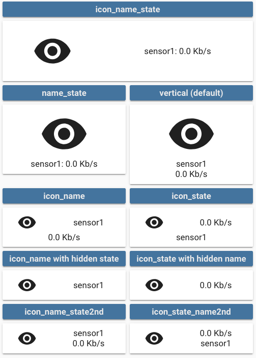

### `triggers_update`

This field defines which entities should trigger an update of the card itself (this rule doesn't apply for nested cards in custom_fields as they are always updated with the latest state. This is expected and fast!). This was introduced in 3.3.0 to reduce the load on the frontend.

If you don't have javascript `[[[ ]]]` templates in your config, you don't need to do anything, else read further.

By default, the card will update itself when the main entity in the configuration is updated. In any case, the card will parse your code and look for entities that it can match (**it only matches `states['ENTITY_ID']`**) so:

```js
return states['switch.myswitch'].state // will match switch.myswitch
 // but
 const test = switch.myswitch
 return states[test].state // will not match anything
```

In this second case, you have 2 options:

- Set the value of `triggers_update` to `all` (This was the behavior of button-card < 3.3.0)

  ```yaml
  triggers_update: all
  ```

- Set the value of `triggers_update` to a list of entities. When any of the entities in this list is updated, the card will be updated. The logic is the same as the internal home-assistant `* templates` integration (see [here](https://www.home-assistant.io/integrations/binary_sensor.template/#entity_id) for example):

  ```yaml
  type: custom:button-card
  entity: sensor.mysensor # No need to repeat this one in the triggers_update, it is added by default
  triggers_update:
    - switch.myswitch
    - light.mylight
  ```

If your entity, any entity in the `triggers_update` field or any entity matched from your templates are a group and you want to update the card if any of the nested entity in that group update its state, then you can set `group_expand` to `true`. It will do the work for you and you won't have to specify manually the full list of entities in `triggers_update`.

### Javascript Templates

The template rendering uses a special format. All the fields where template is supported also support plain text. To activate the templating feature for such a field, you'll need to enclose the javascript function inside 3 square brackets: `[[[ javascript function here ]]]`

Don't forget to quote if it's on one line:

```yaml
name: '[[[ if (entity.state > 42) return "Above 42"; else return "Below 42" ]]]'
name: >
  [[[
    if (entity.state > 42)
      return "Above 42";
    else
      return "Below 42";
  ]]]
```

Those are the configuration fields which support templating:

- `name` (Supports also HTML rendering): This needs to return a string or an `` html`<elt></elt>` `` object
- `state_display` (Supports also HTML rendering): This needs to return a string or an `` html`<elt></elt>` `` object
- `label` (Supports also HTML rendering): This needs to return a string or an `` html`<elt></elt>` `` object
- `entity_picture`: This needs to return a path to a file or a url as a string.
- `icon`: This needs to return a string in the format `mdi:icon`
- All the styles in the style object: This needs to return a string
- All the value of the state object, apart from when the operator is `regex`
  - `operator: template`: The function for `value` needs to return a boolean
  - Else: The function for `value` needs to return a string or a number
- All the `custom_fields` (Support also HTML rendering): This needs to return a string or an `` html`<elt></elt>` `` object
- All the `styles`: Each entry needs to return a string (See [here](#custom-fields) for some examples)
- The `extra_styles` field
- Everything field in `*_action`
- The confirmation text (`confirmation.text`)
- The lock being enabled or not (`lock.enabled`)
- all the `card` parameters in a `custom_field`
- all the `variables`

Special fields which do support templating but are **only evaluated once**, when the configuration is loaded. Error in those templates will only be visible in the javascript console and the card will not display in that case:

- `entity`: You can use JS templates for the `entity` of the card configuration. It is mainly useful when you define your entity in as an entry in `variables`. This is evaluated once only when the configuration is loaded.

  ```yaml
  type: custom:button-card
  variables:
    my_entity: switch.skylight
  entity: '[[[ return variables.my_entity; ]]]'
  ```

- `triggers_update`: Useful when you define multiple entities in `variables` to use throughout the card. Eg:

  ```yaml
  type: custom:button-card
  variables:
    my_entity: switch.skylight
    my_other_entity: light.bedroom
  entity: '[[[ return variables.my_entity; ]]]'
  label: '[[[ return localize(variables.my_other_entity) ]]]'
  show_label: true
  triggers_update:
    - '[[[ return variables.my_entity; ]]]'
    - '[[[ return variables.my_other_entity; ]]]'
  ```

Inside the javascript code, you'll have access to those variables:

- `this`: The button-card element itself (advanced stuff, don't mess with it)
- `entity`: The current entity object, if the entity is defined in the card
- `states`: An object with all the states of all the entities (equivalent to `hass.states`)
- `user`: The user object (equivalent to `hass.user`)
- `hass`: The complete `hass` object
- `variables`: an object containing all your variables defined in the configuration. See [Variables](#variables)
- Helper functions availble through the object `helpers`:
  - `helpers.localize(entity, state?, numeric_precision?, show_units?, units?)`: a function which localizes a state to your language (eg. `helpers.localize(entity)`) and returns a string. Takes an entity object as argument (not the state of the entity as we need context) and takes optional arguments. Works with numerical states also.
    - If `state` is not provided, it localizes the state of the `entity` (Eg. `helpers.localize(entity)` or `helpers.localize(states['weather.your_city'])`).
    - If `state` is provided, it localizes `state` in the context of the `entity` (eg. : `helpers.localize(entity, entity.attributes.forecast[0].condition)` or `helpers.localize(states['weather.your_city'], states['weather.your_city'].attributes.forecast[0].condition)`)
    - `numeric_precision` (number or `'card'`. Default is `undefined`): For state which are numbers, force the precision instead of letting HA decide for you. If the value is set to `'card'`, it will use the `numeric_precision` from the main config. If `undefined`, it will use the default value for the entity you're willing to display. The latter is the default.
    - `show_units` (boolean. Default is `true`): Will display units or not. Default is to display them.
    - `units` (string): Will force the units to be the value of that parameter.
    - To skip one or multiple parameter while calling the function, use `undefined`. Eg. `helpers.localize(states['sensor.temperature'], undefined, 1, undefined, 'Celcius')`
  - Date, Time and Date Time format helpers, all localized (takes a string or a `Date` object as input):
    - `helpers.formatTime(time)`: 21:15 / 9:15
    - `helpers.formatTimeWithSeconds(time)`: 9:15:24 PM || 21:15:24
    - `helpers.formatTimeWeekday(time)`: Tuesday 7:00 PM || Tuesday 19:00
    - `helpers.formatTime24h(time)`: 21:15
    - `helpers.formatDateWeekdayDay(date)`: Tuesday, August 10
    - `helpers.formatDate(date)`: August 10, 2021
    - `helpers.formatDateNumeric(date)`: 10/08/2021
    - `helpers.formatDateShort(date)`: Aug 10
    - `helpers.formatDateMonthYear(date)`: August 2021
    - `helpers.formatDateMonth(date)`: August
    - `helpers.formatDateYear(date)`: 2021
    - `helpers.formatDateWeekday(date)`: Monday
    - `helpers.formatDateWeekdayShort(date)`: Mon
    - `helpers.formatDateTime(datetime)`: August 9, 2021, 8:23 AM
    - `helpers.formatDateTimeNumeric(datetime)`: Aug 9, 2021, 8:23 AM
    - `helpers.formatDateTimeWithSeconds(datetime)`: Aug 9, 8:23 AM
    - `helpers.formatShortDateTime(datetime)`: August 9, 2021, 8:23:15 AM
    - `helpers.formatShortDateTimeWithYear(datetime)`: 9/8/2021, 8:23 AM
    - Example: `return helpers.formatDateTime(entity.attribute.last_changed)`
  - `helpers.relativeTime(date, capitalize? = false)`: Returns an lit-html template which will render a relative time and update automatically. `date` should be a string. `capitalize` is an optional boolean, if set to `true`, the first letter will be uppercase. Usage for eg.: `return helpers.relativeTime(entity.last_changed)`

See [here](#templates-support) for some examples or [here](#custom-fields) for some crazy advanced stuff using templates!

### Styles

All the styles entries, support Templating, see [here](#custom-fields) for some examples.

#### Easy styling options

For each element in the card, styles can be defined in 2 places:

- in the main part of the config
- in each state

Styles defined in each state are **additive** with the ones defined in the main part of the config. In the `state` part, just define the ones specific to your current state and keep the common ones in the main part of the config.

The `style` object members are:

- `card`: styles for the card itself. Styles that are defined here will be applied to the whole card and its content, unless redefined in elements below.
- `icon`: styles for the icon
- `entity_picture`: styles for the picture (if any)
- `name`: styles for the name
- `state`: styles for the state
- `label`: styles for the label
- `lock`: styles for the lock icon (see [here](https://github.com/custom-cards/button-card/blob/master/src/styles.ts#L73-L86) for the default style)
- `tooltip`: styles for the tooltip overlay (see [here](https://github.com/custom-cards/button-card/blob/master/src/styles.ts#L30-L46))
- `custom_fields`: styles for each of your custom fields. See [Custom Fields](#custom-fields)

```yaml
- type: custom:button-card
  [...]
  styles:
    card:
      - xxxx: value
    icon:
      - xxxx: value
    entity_picture:
      - xxxx: value
    name:
      - xxxx: value
    state:
      - xxxx: value
    label:
      - xxxx: value
  state:
    - value: 'on'
      styles:
        card:
          - yyyy: value
        icon:
          - yyyy: value
        entity_picture:
          - yyyy: value
        name:
          - yyyy: value
        state:
          - yyyy: value
        label:
          - yyyy: value
```

This will render:

- The `card` with the styles `xxxx: value` **and** `yyyy: value` applied
- Same for all the others.

See [styling](#styling) for a complete example.

#### Light entity color variable

If a light entity is assigned to the button, then:

- the CSS variable `--button-card-light-color` will contain the current light color
- the CSS variable `--button-card-light-color-no-temperature` will contain the current light without the temperature

You can use them both in other parts of the button. When off, it will be set to `var(--paper-item-icon-color)`

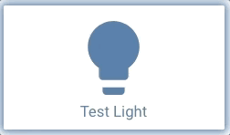

```yaml
styles:
  name:
    - color: var(--button-card-light-color)
  card:
    - -webkit-box-shadow: 0px 0px 9px 3px var(--button-card-light-color)
    - box-shadow: 0px 0px 9px 3px var(--button-card-light-color)
```

#### ADVANCED styling options

For advanced styling, there are 2 other options in the `styles` config object:

- `grid`: mainly layout for the grid
- `img_cell`: mainly how you position your icon in its cell

This is how the button is constructed (HTML elements):

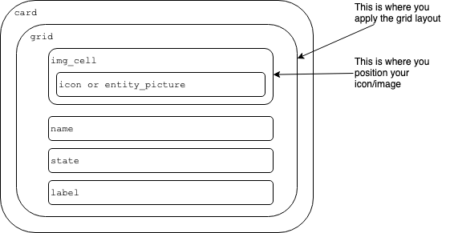

The `grid` element uses CSS grids to design the layout of the card:

- `img_cell` element is going to the `grid-area: i` by default
- `name` element is going to the `grid-area: n` by default
- `state` element is going to the `grid-area: s` by default
- `label` element is going to the `grid-area: l` by default

You can see how the default layouts are constructed [here](./src/styles.ts#L152) and inspire yourself with it. We'll not support advanced layout questions here, please use [Home Assistant's community forum][forum] for that.

To learn more, please use Google and this [excellent guide about CSS Grids](https://css-tricks.com/snippets/css/complete-guide-grid/) :)

For a quick overview on the grid-template-areas attribute, the following example should get you started:

```yaml
- grid-template-areas: '"i n s" "i n s" "i n l"'
```

If we take the value and orient it into rows and columns, you begin to see the end result.

```
"i n s"
"i n s"
"i n l"
```

The end product will results in the following grid layout

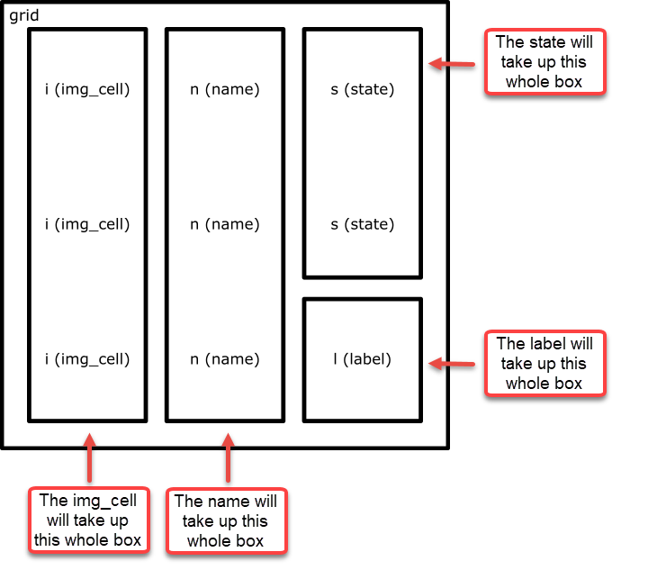

Some examples:

- label on top:

  ```yaml
  styles:
    grid:
      - grid-template-areas: '"l" "i" "n" "s"'
      - grid-template-rows: min-content 1fr min-content min-content
      - grid-template-columns: 1fr
  ```

- icon on the right side (by overloading an existing layout):

  ```yaml
  - type: 'custom:button-card'
    entity: sensor.sensor1
    layout: icon_state_name2nd
    show_state: true
    show_name: true
    show_label: true
    label: label
    styles:
      grid:
        - grid-template-areas: '"n i" "s i" "l i"'
        - grid-template-columns: 1fr 40%
  ```

- Apple Homekit-like buttons:

  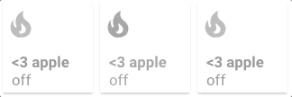

  ```yaml
  - type: custom:button-card
    entity: switch.skylight
    name: <3 Apple
    icon: mdi:fire
    show_state: true
    styles:
      card:
        - width: 100px
        - height: 100px
      grid:
        - grid-template-areas: '"i" "n" "s"'
        - grid-template-columns: 1fr
        - grid-template-rows: 1fr min-content min-content
      img_cell:
        - align-self: start
        - text-align: start
      name:
        - justify-self: start
        - padding-left: 10px
        - font-weight: bold
        - text-transform: lowercase
      state:
        - justify-self: start
        - padding-left: 10px
    state:
      - value: 'off'
        styles:
          card:
            - filter: opacity(50%)
          icon:
            - filter: grayscale(100%)
  ```

#### Injecting CSS with `extra_styles`

**Note**: `extra_styles` **MUST NOT** be used on the first button-card of the current view, else it will be applied to all the cards in all Lovelace. **It is not possible to fix this behaviour.**

You can inject any CSS style you want using this config option. It is useful if you want to inject CSS animations for example. This field supports [templates](#javascript-templates).

An example is better than words:


```yaml
- type: custom:button-card
  name: Change Background
  aspect_ratio: 2/1
  extra_styles: |
    @keyframes bgswap1 {
      0% {
        background-image: url("/local/background1.jpg");
      }
      25% {
        background-image: url("/local/background1.jpg");
      }
      50% {
        background-image: url("/local/background2.jpg");
      }
      75% {
        background-image: url("/local/background2.jpg");
      }
      100% {
        background-image: url("/local/background1.jpg");
      }
    }
  styles:
    card:
      - animation: bgswap1 10s linear infinite
      - background-size: cover
    name:
      - color: white
```

### Custom Fields

Custom fields support, using the `custom_fields` object, enables you to create your own fields on top of the pre-defined ones (name, state, label and icon). This is an advanced feature which leverages (if you require it) the CSS Grid.

Custom fields also support embeded cards, see [example below](#custom_fields_card_example).

Each custom field supports its own styling config, the name needs to match between both objects needs to match:

```yaml
- type: custom:button-card
  [...]
  custom_fields:
    test_element: My test element
  styles:
    custom_fields:
      test_element:
        - color: red
        - font-size: 13px
```

Examples are better than a long text, so here you go:

- Placing an element wherever you want (that means bypassing the grid). Set the grid to `position: relative` and set the element to `position: absolute`

  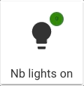

  ```yaml
  - type: custom:button-card
    icon: mdi:lightbulb
    aspect_ratio: 1/1
    name: Nb lights on
    styles:
      grid:
        - position: relative
      custom_fields:
        notification:
          - background-color: >
              [[[
                if (states['input_number.test'].state == 0)
                  return "green";
                return "red";
              ]]]


          - border-radius: 50%
          - position: absolute
          - left: 60%
          - top: 10%
          - height: 20px
          - width: 20px
          - font-size: 8px
          - line-height: 20px
    custom_fields:
      notification: >
        [[[ return Math.floor(states['input_number.test'].state / 10) ]]]
  ```

- Or you can use the grid. Each element will have it's name positioned as the `grid-area`:

  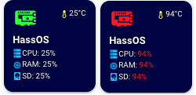

  ```yaml
  - type: custom:button-card
    entity: 'sensor.raspi_temp'
    icon: 'mdi:raspberry-pi'
    aspect_ratio: 1/1
    name: HassOS
    styles:
      card:
        - background-color: '#000044'
        - border-radius: 10%
        - padding: 10%
        - color: ivory
        - font-size: 10px
        - text-shadow: 0px 0px 5px black
        - text-transform: capitalize
      grid:
        - grid-template-areas: '"i temp" "n n" "cpu cpu" "ram ram" "sd sd"'
        - grid-template-columns: 1fr 1fr
        - grid-template-rows: 1fr min-content min-content min-content min-content
      name:
        - font-weight: bold
        - font-size: 13px
        - color: white
        - align-self: middle
        - justify-self: start
        - padding-bottom: 4px
      img_cell:
        - justify-content: start
        - align-items: start
        - margin: none
      icon:
        - color: >
            [[[
              if (entity.state < 60) return 'lime';
              if (entity.state >= 60 && entity.state < 80) return 'orange';
              else return 'red';
            ]]]


        - width: 70%
        - margin-top: -10%
      custom_fields:
        temp:
          - align-self: start
          - justify-self: end
        cpu:
          - padding-bottom: 2px
          - align-self: middle
          - justify-self: start
          - --text-color-sensor: '[[[ if (states["sensor.raspi_cpu"].state > 80) return "red"; ]]]'
        ram:
          - padding-bottom: 2px
          - align-self: middle
          - justify-self: start
          - --text-color-sensor: '[[[ if (states["sensor.raspi_ram"].state > 80) return "red"; ]]]'
        sd:
          - align-self: middle
          - justify-self: start
          - --text-color-sensor: '[[[ if (states["sensor.raspi_sd"].state > 80) return "red"; ]]]'
    custom_fields:
      temp: >
        [[[
          return `<ha-icon
            icon="mdi:thermometer"
            style="width: 12px; height: 12px; color: yellow;">
            </ha-icon><span>${entity.state}°C</span>`
        ]]]


      cpu: >
        [[[
          return `<ha-icon
            icon="mdi:server"
            style="width: 12px; height: 12px; color: deepskyblue;">
            </ha-icon><span>CPU: <span style="color: var(--text-color-sensor);">${states['sensor.raspi_cpu'].state}%</span></span>`
        ]]]


      ram: >
        [[[
          return `<ha-icon
            icon="mdi:memory"
            style="width: 12px; height: 12px; color: deepskyblue;">
            </ha-icon><span>RAM: <span style="color: var(--text-color-sensor);">${states['sensor.raspi_ram'].state}%</span></span>`
        ]]]


      sd: >
        [[[
          return `<ha-icon
            icon="mdi:harddisk"
            style="width: 12px; height: 12px; color: deepskyblue;">
            </ha-icon><span>SD: <span style="color: var(--text-color-sensor);">${states['sensor.raspi_sd'].state}%</span></span>`
        ]]]
  ```

- <a name="custom_fields_card_example"></a>Or you can embed a card (or multiple) inside the button card (note, this configuration uses [card-mod](https://github.com/thomasloven/lovelace-card-mod) to remove the `box-shadow` of the sensor card.

- This is what the `style` inside the embedded card is for):

  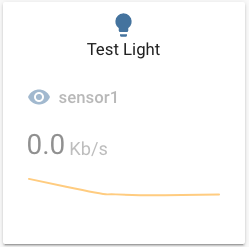

  ```yaml
  - type: custom:button-card
    aspect_ratio: 1/1
    custom_fields:
      graph:
        card:
          type: sensor
          entity: sensor.sensor1
          graph: line
          style: |
            ha-card {
              box-shadow: none;
            }
    styles:
      custom_fields:
        graph:
          - filter: opacity(50%)
          - overflow: unset
      card:
        - overflow: unset
      grid:
        - grid-template-areas: '"i" "n" "graph"'
        - grid-template-columns: 1fr
        - grid-template-rows: 1fr min-content min-content

    entity: light.test_light
    hold_action:
      action: more-info
  ```

To skip evaluating the templates in a custom_field (eg. you embed a `custom:button-card` inside a Custom Field), then you have to set `do_not_eval` to `true`.

```yaml
type: custom:button-card
styles:
  grid:
    - grid-template-areas: "'test1' 'test2'"
variables:
  b: 42
custom_fields:
  test1:
    card:
      type: custom:button-card
      variables:
        c: 42
      ## This will return: B: 42 / C: undefined
      ## as it is evaluated in the context of the
      ## main card (which doesn't know about c)
      name: '[[[ return `B: ${variables.b} / C: ${variables.c}` ]]]'
  test2:
    ## This stops the evaluation of js templates
    ## for the card object in this custom field
    do_not_eval: true
    card:
      type: custom:button-card
      variables:
        c: 42
      ## This will return: B: undefined / C: 42
      ## as it is evaluated in the context of the local button-card
      ## inside the custom_field (which doesn't know about b)
      name: '[[[ return `B: ${variables.b} / C: ${variables.c}` ]]]'
```

### Configuration Templates

#### General

- Define your config template in the main lovelace configuration and then use it in your button-card. This will avoid a lot of repetitions! It's basically YAML anchors, but without using YAML anchors and is very useful if you split your config in multiple files 😄
- You can overload any parameter with a new one
- You can merge states together **by `id`** when using templates. The states you want to merge have to have the same `id`. This `id` parameter is new and can be anything (string, number, ...). States without `id` will be appended to the state array. Styles embedded in a state are merged together as usual. See [here](#merging-state-by-id) for an example.
- You can also inherit another template from within a template.
- You can inherit multiple templates at once by making it an array. In this case, the templates will be merged together with the current configuration in the order they are defined. This happens recursively.

  ```yaml
  type: custom:button-card
  template:
    - template1
    - template2
  ```

  The button templates will be applied in the order they are defined: `template2` will be merged with `template1` and then the local config will be merged with the result. You can still chain templates together (ie. define template in a button-card template. It will follow the path recursively).

Make sure which type of lovelace dashboard you are using before changing the main lovelace configuration:

- **`managed`** changes are managed by lovelace ui - add the template configuration to configuration in raw editor
  - go to your dashboard
  - click three dots and `Edit dashboard` button
  - click three dots again and click `Raw configuration editor` button
- **`yaml`** - add template configuration to your `ui-lovelace.yaml`

```yaml
button_card_templates:
  header:
    styles:
      card:
        - padding: 5px 15px
        - background-color: var(--paper-item-icon-active-color)
      name:
        - text-transform: uppercase
        - color: var(--primary-background-color)
        - justify-self: start
        - font-weight: bold
      label:
        - text-transform: uppercase
        - color: var(--primary-background-color)
        - justify-self: start
        - font-weight: bold

  header_red:
    template: header
    styles:
      card:
        - background-color: '#FF0000'

  my_little_template: [...]
```

And then where you use button-card, you can apply this template, and/or overload it:

```yaml
- type: custom:button-card
  template: header_red
  name: My Test Header
```

#### Merging state by id

Example to merge state by `id`:

```yaml
button_card_templates:
  sensor:
    styles:
      card:
        - font-size: 16px
        - width: 75px
    tap_action:
      action: more-info
    state:
      - color: orange
        value: 75
        id: my_id

  sensor_humidity:
    template: sensor
    icon: 'mdi:weather-rainy'
    state:
      - color: 'rgb(255,0,0)'
        operator: '>'
        value: 50
      - color: 'rgb(0,0,255)'
        operator: '<'
        value: 25

  sensor_test:
    template: sensor_humidity
    state:
      - color: pink
        id: my_id
        operator: '>'
        value: 75
        styles:
          name:
            - color: '#ff0000'
############### Used like this ##############
  - type: custom:button-card
    template: sensor_test
    entity: input_number.test
    show_entity_picture: true
```

Will result in this state object for your button (styles, operator and color are overridden for the `id: my_id` as you can see):

```yaml
state:
  - color: pink
    operator: '>'
    value: 75
    styles:
      name:
        - color: '#ff0000'
  - color: 'rgb(255,0,0)'
    operator: '>'
    value: 50
  - color: 'rgb(0,0,255)'
    operator: '<'
    value: 25
```

#### Variables

You can add variables to your templates and overload them in the instance of your button card. This lets you easily work with templates without the need to redefine everything for a small change.

An example below:

```yaml
button_card_templates:
  variable_test:
    variables:
      var_name: "var_value"
      var_name2: "var_value2"
    name: '[[[ return variables.var_name ]]]'

[...]

- type: custom:button-card
  template: variable_test
  entity: sensor.test
  # name will be "var_value"

- type: custom:button-card
  template: variable_test
  entity: sensor.test
  variables:
    var_name: "My local Value"
 # name will be "My local Value"
```

Variables are evaluated in their alphabetical order based on their name. That means a variable named `b` can depend on a variable named `a`, but variable named `a` can't depend on a variable named `b`.

```yaml
### This works
variables:
  index: 2
  value: '[[[ return variables.index + 2; ]]]'
name: '[[[ return variable.value; ]]]' # would return 4

### This doesn't work
variables:
  z_index: 2
  value: '[[[ return variables.z_index + 2; ]]]' # This would fail because z comes after v in the alphabet.
name: '[[[ return variable.value; ]]]'
```

## Installation

### Manual Installation

1. Download the [button-card](http://www.github.com/custom-cards/button-card/releases/latest/download/button-card.js)
2. Place the file in your `config/www` folder
3. Include the card code in your `ui-lovelace-card.yaml`

   ```yaml
   title: Home
   resources:
     - url: /local/button-card.js
       type: module
   ```

4. Write configuration for the card in your `ui-lovelace.yaml`

### Installation and tracking with `hacs`

1. Make sure the [HACS](https://github.com/custom-components/hacs) component is installed and working.
2. Search for `button-card` and add it through HACS
3. Add the configuration to your `ui-lovelace.yaml`

   ```yaml
   resources:
     - url: /hacsfiles/button-card/button-card.js
       type: module
   ```

4. Refresh home-assistant.

## Examples

Show a button for the air conditioner (blue when on, `var(--disabled-text-color)` when off):


```yaml
- type: 'custom:button-card'
  entity: switch.ac
  icon: mdi:air-conditioner
  color: rgb(28, 128, 199)
```

Redefine the color when the state if off to red:

```yaml
- type: 'custom:button-card'
  entity: switch.ac
  icon: mdi:air-conditioner
  color: rgb(28, 128, 199)
  state:
    - value: 'off'
      color: rgb(255, 0, 0)
```

---

Show an ON/OFF button for the home_lights group:


```yaml
- type: 'custom:button-card'
  entity: group.home_lights
  show_icon: false
  show_state: true
```

---

Light entity with custom icon and "more info" pop-in:

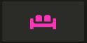

```yaml
- type: 'custom:button-card'
  entity: light.living_room_lights
  icon: mdi:sofa
  color: auto
  tap_action:
    action: more-info
```

---

Light card with card color type, name, and automatic color:


```yaml
- type: 'custom:button-card'
  entity: light._
  icon: mdi:home
  color: auto
  color_type: card
  tap_action:
    action: more-info
  name: Home
  styles:
    card:
      - font-size: 12px
      - font-weight: bold
```

---

Horizontal stack with :

- 2x blank cards
- 1x volume up button with service call
- 1x volume down button with service call
- 2x blank cards


```yaml
- type: horizontal-stack
  cards:
    - type: 'custom:button-card'
      color_type: blank-card
    - type: 'custom:button-card'
      color_type: blank-card
    - type: 'custom:button-card'
      color_type: card
      color: rgb(223, 255, 97)
      icon: mdi:volume-plus
      tap_action:
        action: call-service
        service: media_player.volume_up
        data:
          entity_id: media_player.living_room_speaker
    - type: 'custom:button-card'
      color_type: card
      color: rgb(223, 255, 97)
      icon: mdi:volume-minus
      tap_action:
        action: call-service
        service: media_player.volume_down
        data:
          entity_id: media_player.living_room_speaker
    - type: 'custom:button-card'
      color_type: blank-card
    - type: 'custom:button-card'
      color_type: blank-card
```

---

Vertical Stack with :

- 1x label card
- Horizontal Stack with :
  - 1x Scene 1 Button
  - 1x Scene 2 Button
  - 1x Scene 3 Button
  - 1x Scene 4 Button
  - 1x Scene Off Button

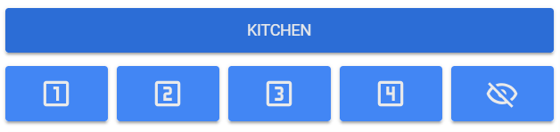

```yaml
- type: vertical-stack
  cards:
    - type: 'custom:button-card'
      color_type: label-card
      color: rgb(44, 109, 214)
      name: Kitchen
    - type: horizontal-stack
      cards:
        - type: 'custom:button-card'
          entity: switch.kitchen_scene_1
          color_type: card
          color: rgb(66, 134, 244)
          icon: mdi:numeric-1-box-outline
        - type: 'custom:button-card'
          entity: switch.kitchen_scene_2
          color_type: card
          color: rgb(66, 134, 244)
          icon: mdi:numeric-2-box-outline
        - type: 'custom:button-card'
          entity: switch.kitchen_scene_3
          color_type: card
          color: rgb(66, 134, 244)
          icon: mdi:numeric-3-box-outline
        - type: 'custom:button-card'
          entity: switch.kitchen_scene_4
          color_type: card
          color: rgb(66, 134, 244)
          icon: mdi:numeric-4-box-outline
        - type: 'custom:button-card'
          entity: switch.kitchen_off
          color_type: card
          color: rgb(66, 134, 244)
          icon: mdi:eye-off-outline
```

### Configuration with states

Input select card with select next service and custom color and icon for states. In the example below the icon `mdi:cube-outline` will be used when value is `sleeping` and `mdi:cube` in other cases.

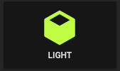

#### Default behavior

If you don't specify any operator, `==` will be used to match the current state against the `value`

```yaml
- type: 'custom:button-card'
  entity: input_select.cube_mode
  icon: mdi:cube
  tap_action:
    action: call-service
    service: input_select.select_next
    data:
      entity_id: input_select.cube_mode
  show_state: true
  state:
    - value: 'sleeping'
      color: var(--disabled-text-color)
      icon: mdi:cube-outline
    - value: 'media'
      color: rgb(5, 147, 255)
    - value: 'light'
      color: rgb(189, 255, 5)
```

#### With Operator on state

The definition order matters, the first item to match will be the one selected.

```yaml
- type: "custom:button-card"
  entity: sensor.temperature
  show_state: true
  state:
    - value: 15
      operator: '<='
      color: blue
      icon: mdi:thermometer-minus
    - value: 25
      operator: '>='
      color: red
      icon: mdi:thermometer-plus
    - operator: 'default' # used if nothing matches
      color: yellow
      icon: mdi: thermometer
      styles:
        card:
          - opacity: 0.5
```

#### `tap_action` Navigate

Buttons can link to different views using the `navigate` action:

```yaml
- type: 'custom:button-card'
  color_type: label-card
  icon: mdi:home
  name: Go To Home
  tap_action:
    action: navigate
    navigation_path: /lovelace/0
```

The `navigation_path` also accepts any Home Assistant internal URL such as /dev-info or /hassio/dashboard for example.

#### blink

You can make the whole button blink:


```yaml
- type: 'custom:button-card'
  color_type: card
  entity: binary_sensor.intruder
  name: Intruder Alert
  state:
    - value: 'on'
      color: red
      icon: mdi:alert
      styles:
        card:
          - animation: blink 2s ease infinite
    - operator: default
      color: green
      icon: mdi:shield-check
```

### Play with width, height and icon size

Through the `styles` you can specify the `width` and `height` of the card, and also the icon size through the main `size` option. Playing with icon size will growth the card unless a `height` is specified.

If you specify a width for the card, it has to be in `px`. All the cards without a `width` defined will use the remaining space on the line.

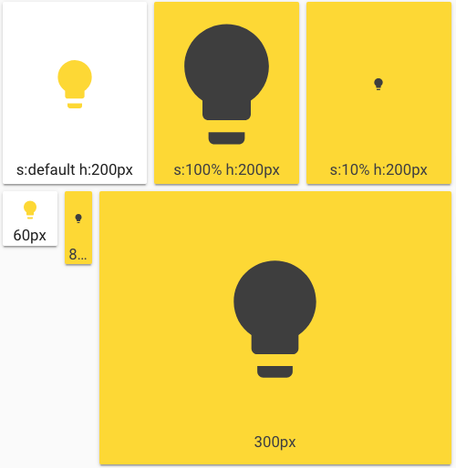

```yaml
- type: horizontal-stack
  cards:
    - type: 'custom:button-card'
      entity: light.test_light
      color: auto
      name: s:default h:200px
      styles:
        card:
          - height: 200px
    - type: 'custom:button-card'
      entity: light.test_light
      color_type: card
      color: auto
      name: s:100% h:200px
      size: 100%
      styles:
        card:
          - height: 200px
    - type: 'custom:button-card'
      entity: light.test_light
      color_type: card
      color: auto
      size: 10%
      name: s:10% h:200px
      styles:
        card:
          - height: 200px
- type: horizontal-stack
  cards:
    - type: 'custom:button-card'
      entity: light.test_light
      color: auto
      name: 60px
      styles:
        card:
          - height: 60px
          - width: 60px
    - type: 'custom:button-card'
      entity: light.test_light
      color_type: card
      color: auto
      name: 80px
      styles:
        card:
          - height: 80px
          - width: 30px
    - type: 'custom:button-card'
      entity: light.test_light
      color_type: card
      color: auto
      name: 300px
      styles:
        card:
          - height: 300px
```

### Templates Support

#### Playing with label templates

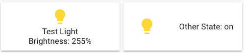

```yaml
- type: 'custom:button-card'
  color_type: icon
  entity: light.test_light
  label: >
    [[[
      var bri = states['light.test_light'].attributes.brightness;
      return 'Brightness: ' + (bri ? bri : '0') + '%';
    ]]]


  show_label: true
  size: 15%
  styles:
    card:
      - height: 100px
- type: 'custom:button-card'
  color_type: icon
  entity: light.test_light
  layout: icon_label
  label: >
    [[[
      return 'Other State: ' + states['switch.skylight'].state;
    ]]]


  show_label: true
  show_name: false
  styles:
    card:
      - height: 100px
```

#### State Templates

The javascript code inside `value` needs to return `true` of `false`.

Example with `template`:

```yaml
- type: 'custom:button-card'
  color_type: icon
  entity: switch.skylight
  show_state: true
  show_label: true
  state:
    - operator: template
      value: >
        [[[
          return states['light.test_light'].attributes
          && (states['light.test_light'].attributes.brightness <= 100)
        ]]]


      icon: mdi:alert
    - operator: default
      icon: mdi:lightbulb
- type: 'custom:button-card'
  color_type: icon
  entity: light.test_light
  show_label: true
  state:
    - operator: template
      value: >
        [[[ return states['input_select.light_mode'].state === 'night_mode' ]]]


      icon: mdi:weather-night
      label: Night Mode
    - operator: default
      icon: mdi:white-balance-sunny
      label: Day Mode
```

### Styling

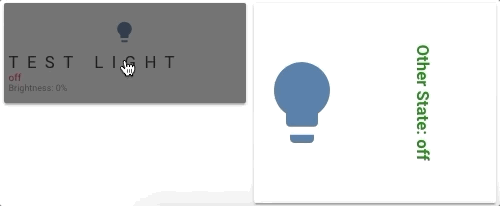

```yaml
- type: 'custom:button-card'
  color_type: icon
  entity: light.test_light
  label: >
    [[[
      var bri = states['light.test_light'].attributes.brightness;
      return 'Brightness: ' + (bri ? bri : '0') + '%';
    ]]]


  show_label: true
  show_state: true
  size: 10%
  styles:
    card:
      - height: 100px
    label:
      - color: gray
      - font-size: 9px
      - justify-self: start
      - padding: 0px 5px
    name:
      - text-transform: uppercase
      - letter-spacing: 0.5em
      - font-familly: cursive
      - justify-self: start
      - padding: 0px 5px
    state:
      - justify-self: start
      - font-size: 10px
      - padding: 0px 5px
  state:
    - value: 'on'
      styles:
        state:
          - color: green
    - value: 'off'
      styles:
        state:
          - color: red
        card:
          - filter: brightness(40%)
- type: 'custom:button-card'
  color_type: icon
  entity: light.test_light
  layout: icon_label
  label: >
    [[[ return 'Other State: ' + states['switch.skylight'].state; ]]]


  show_label: true
  show_name: false
  size: 100%
  styles:
    card:
      - height: 200px
    label:
      - font-weight: bold
      - writing-mode: vertical-rl
      - text-orientation: mixed
  state:
    - value: 'on'
      styles:
        label:
          - color: red
    - value: 'off'
      styles:
        label:
          - color: green
```

### Lock

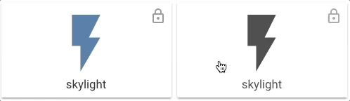

```yaml
- type: horizontal-stack
  cards:
    - type: 'custom:button-card'
      entity: switch.test
      lock:
        enabled: true
    - type: 'custom:button-card'
      color_type: card
      lock:
        enabled: true
      color: black
      entity: switch.test
```

### Aspect Ratio

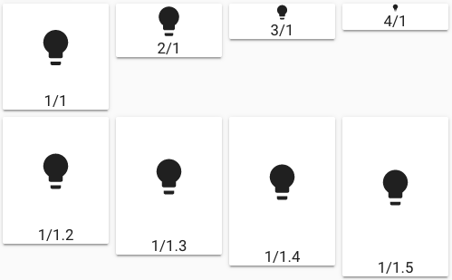

```yaml
- type: vertical-stack
  cards:
    - type: horizontal-stack
      cards:
        - type: custom:button-card
          name: 1/1
          icon: mdi:lightbulb
          aspect_ratio: 1/1
        - type: custom:button-card
          name: 2/1
          icon: mdi:lightbulb
          aspect_ratio: 2/1
        - type: custom:button-card
          name: 3/1
          icon: mdi:lightbulb
          aspect_ratio: 3/1
        - type: custom:button-card
          name: 4/1
          icon: mdi:lightbulb
          aspect_ratio: 4/1
    - type: horizontal-stack
      cards:
        - type: custom:button-card
          name: 1/1.2
          icon: mdi:lightbulb
          aspect_ratio: 1/1.2
        - type: custom:button-card
          name: 1/1.3
          icon: mdi:lightbulb
          aspect_ratio: 1/1.3
        - type: custom:button-card
          name: 1/1.4
          icon: mdi:lightbulb
          aspect_ratio: 1/1.4
        - type: custom:button-card
          name: 1/1.5
          icon: mdi:lightbulb
          aspect_ratio: 1/1.5
```

### Changing the feedback color during a click

For dark cards, it can be usefull to change the feedback color when clicking the button. The ripple effect uses a `mwc-ripple` element so you can style it with the CSS variables it supports.

For example:

```yaml
styles:
  card:
    - --mdc-ripple-color: blue
    - --mdc-ripple-press-opacity: 0.5
```

## Community guides

- [robotnet.dk](https://robotnet.dk/2020/homekit-knapper-custom-buttons-home-assistant.html): Danish tutorial and how-to about using Lovelace Button card for your entities.

## Credits

- [ciotlosm](https://github.com/ciotlosm) for the readme template and some awesome examples
- [iantrich](https://github.com/iantrich), [LbDab](https://github.com/lbdab) and [jimz011](https://github.com/jimz011) for the inspiration and the awesome templates and cards you've created.
